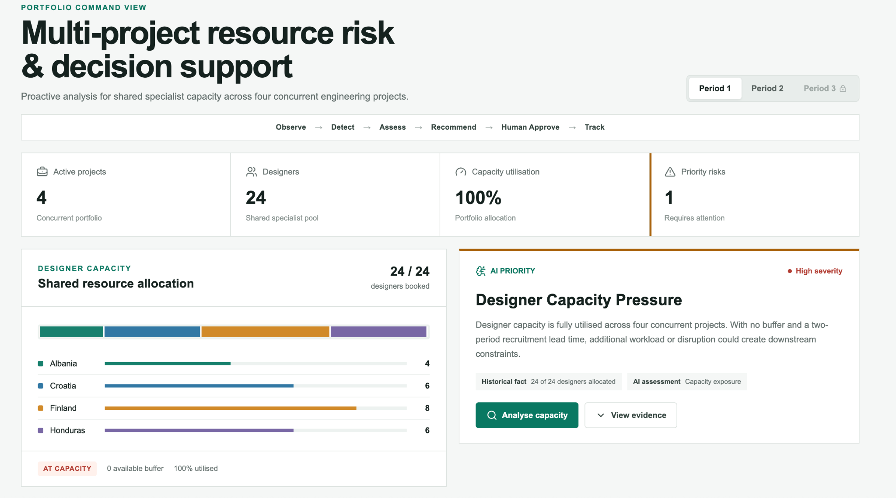
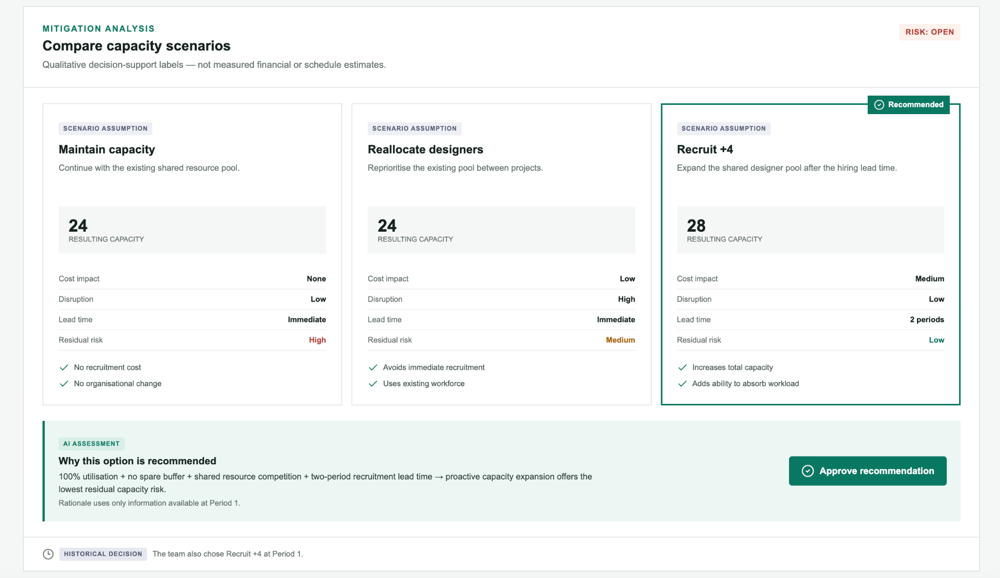

# AI Project Control Tower

**From project monitoring to explainable, agentic decision support.**

> **Observe → Detect → Assess → Recommend → Human Approve → Track**

AI Project Control Tower is an agentic decision-support MVP for multi-project environments. Instead of only reporting project KPIs, it is designed to **continuously update existing risks, detect emerging issues, evaluate interventions, and surface explainable recommendations for human approval at each reporting cycle.**

### What makes this project different

- **Continuous Agent Workflow** — designed to re-assess portfolio state at every reporting cycle, rather than perform a one-off analysis.
- **Explainable Decisions** — every risk and recommendation is connected to visible evidence and explicit decision logic.
- **Human-in-the-loop** — the Agent recommends interventions; consequential project decisions remain with managers.
- **No hindsight disguised as AI** — the MVP is evaluated through point-in-time historical backtesting with future outcomes excluded from recommendation inputs.

[**Live Demo →**](https://ai-project-control-tower.vercel.app) · **MVP v0.1.1**





---

## The Product

Traditional project dashboards are good at answering:

> **What is happening?**

The Control Tower is designed to go further:

> **What deserves attention → Why does it matter → What can we do → What should we prioritise?**

### Product Layer

In a real deployment, the Control Tower would operate continuously across reporting cycles:

```text
Latest Project State
        ↓
      Observe
        ↓
      Detect
        ↓
      Assess
        ↓
     Recommend
        ↓
   Human Approve
        ↓
       Track
        ↓
Next Reporting Cycle ↺
```

At each new cycle, the system is designed to **update existing risks and scan for newly emerging risks**, rather than repeatedly analysing a fixed issue.

---

## Flagship MVP Case — Designer Capacity Pressure

The current MVP implements one complete vertical slice using historical multi-project engineering decision data.

Four concurrent projects shared a pool of **24 Designers**.

At the Period 1 decision point:

| Signal | Evidence |
| --- | ---: |
| Designer allocation | **24 / 24** |
| Portfolio utilisation | **100%** |
| Spare capacity | **0** |
| Projects sharing the resource | **4** |
| Recruitment lead time | **2 periods** |

The Control Tower detects:

> 🔴 **Designer Capacity Pressure — High Severity**

It then compares three interventions:

| Scenario | Capacity | Disruption* | Residual Risk* |
| --- | ---: | --- | --- |
| Maintain Capacity | 24 | Low | High |
| Reallocate Designers | 24 | High | Medium |
| **Recruit +4** | **28** | **Low** | **Low** |

\* Qualitative scenario assumptions for decision support, not measured financial or schedule estimates.

### Recommendation

**Recruit +4 Designers**

**Why?**

> 100% utilisation + zero spare buffer + shared-resource competition + two-period recruitment lead time → proactive capacity expansion offers the lowest residual capacity risk.

The Agent surfaces the recommendation, but **a human must approve the intervention**.

---

## Product Layer ≠ Evaluation Layer

This distinction is central to the project.

### Product Layer

The product is designed to run repeatedly:

> **New reporting cycle → update risks → detect new risks → recommend intervention → human decision → track**

Historical comparison is **not** the product's primary use case.

### Evaluation Layer

Because this MVP is not deployed inside a live enterprise, I needed a way to test whether its recommendations were reasonable without giving the Agent knowledge of what happened later.

I therefore use:

> **Point-in-time historical backtesting with strict future-data isolation.**

The Period 1 recommendation is generated only from information available at that decision point. Later-period observations are excluded from the recommendation input.

The validation outcome is revealed only afterwards:

> **24/24 → Recruit +4 → 28/28**

The additional Designer capacity was subsequently fully utilised.

This supports the operational relevance of proactive capacity planning, but **does not prove that delay would have occurred without recruitment**. The historical outcome is validation evidence, not a causal counterfactual.

---

## How It Works

```text
Structured Project State
          ↓
    Resource Engine
          ↓
       Risk Layer
          ↓
    Scenario Engine
          ↓
Explainable Recommendation
          ↓
     Human Approval
          ↓
        Tracking
```

The MVP uses deterministic logic where precision matters:

- **Resource Engine** — utilisation, capacity and buffer calculations
- **Risk Engine** — structured risk detection from explicit signals
- **Scenario Engine** — comparison of intervention alternatives

These support **one Control Tower decision workflow**; they are not presented as three separate AI Agents.

The broader architecture is designed for future agent orchestration across project data and analytical tools.

> **Design principle: use AI where reasoning is needed; use deterministic tools where precision is needed.**

---

## Built for Enterprise Extension

The current MVP uses a small structured historical dataset. In a production environment, the same workflow could sit above project systems and reporting sources:

```text
PMIS / ERP / Resource / Schedule Data
                 ↓
        Unified Project State
                 ↓
        AI Project Control Tower
                 ↓
 Analytical Tools + Risk Layer
                 ↓
     Explainable Intervention
                 ↓
          Human Approval
```

Structured calculations would remain deterministic, while AI could support orchestration and reasoning over unstructured sources such as progress reports, meeting notes and supplier updates.

---

## MVP Scope & Tech

**Current scope:** one end-to-end shared-resource risk vertical slice. The goal is to validate the reusable decision workflow before expanding feature breadth.

**Stack:** Next.js · TypeScript · Tailwind CSS · Recharts · Vercel

Original course files and teaching materials are not redistributed. Only the reconstructed data required for the demonstration is included.

---

# 中文简介

**AI Project Control Tower：从项目监控走向可解释的 Agentic 决策支持。**

> **观察 → 检测 → 评估 → 推荐 → 人工审批 → 跟踪**

这是一个面向多项目环境的 AI 决策支持 MVP。与传统 Dashboard 主要回答“发生了什么”不同，Control Tower 的目标是在**每个 reporting cycle** 读取最新项目状态，持续更新已有风险、发现新风险、比较干预方案，并向管理者提供可解释的 recommendation。

### 当前 MVP

四个并行项目共享 24 名 Designer。Period 1 出现：

> **24/24 allocation · 100% utilisation · 0 spare buffer · 2-period recruitment lead time**

系统识别 **Designer Capacity Pressure**，比较 Maintain / Reallocate / Recruit +4 三种方案，并基于当时可获得的信息推荐主动扩充 capacity，同时保留人工审批。

### 两层核心设计

**Product Layer**

> 新 reporting cycle → 更新已有风险 → 发现新风险 → 评估 → 推荐干预 → 人工审批 → 持续跟踪

这才是 Control Tower 在真实企业中的核心使用方式。

**Evaluation Layer**

当前 MVP 尚未部署在真实企业，因此使用 **point-in-time historical backtesting** 进行验证。

Agent 在 Period 1 做判断时严格禁止使用未来 outcome；完成 recommendation 后才揭示：

> **24/24 → Recruit +4 → 28/28**

后续新增 capacity 被全部使用，为 recommendation 提供历史验证证据，但项目不会将其夸大为因果证明。

**核心原则：不是为了使用 AI 而使用 AI——需要推理的地方使用 AI，需要精确计算的地方使用 deterministic tools。**
